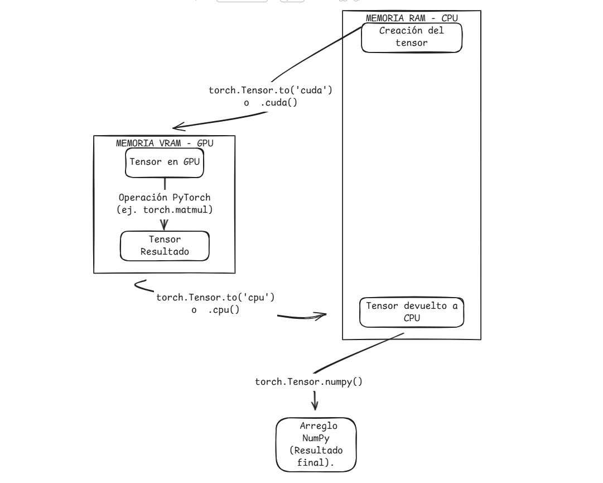
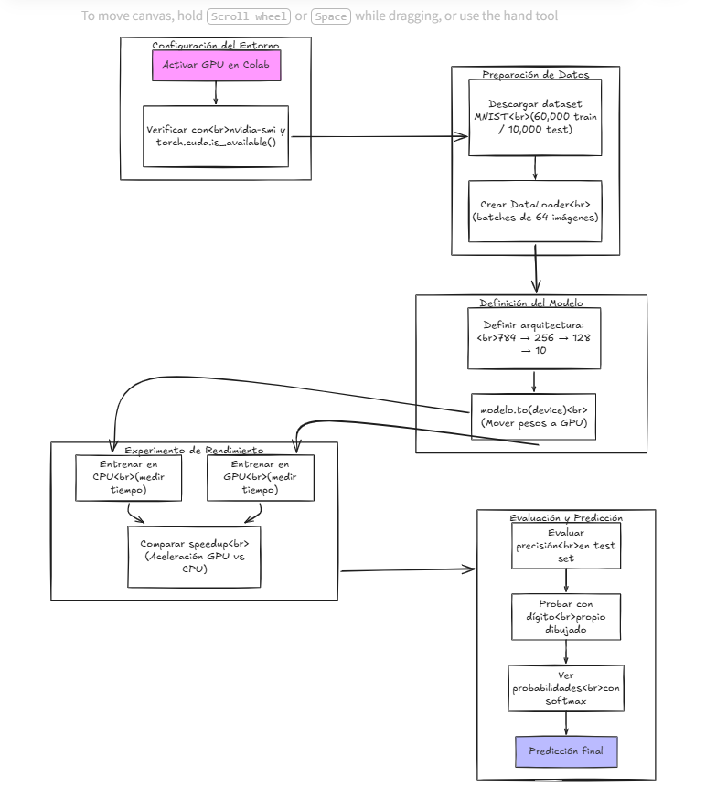

# Entrenamiento de Redes Neuronales en GPU
## CUDA con PyTorch en Google Colab

---

| Campo | Detalle |
|---|---|
| **Parcial** | Segundo Corte |
| **Materia** | Programación Paralela y Computación Distribuida |
| **Profesor** | Prf. Juan Alejandro Carrillo Jaimes |
| **Integrante 1** | Brahayan Aldhair Campo Sanchez — C.C. 1052379707 |
| **Integrante 2** | Diego Gilberto Rodriguez Portilla — C.C. 1098626979 |
| **Semestre** | 2026-I |

---

## 0. Instrucciones Generales

### Pregunta 1
> ¿Qué diferencia hay entre un notebook en la nube (Colab) y un entorno local? ¿Cuál prefieren y por qué?

Un notebook en la nube como Google Colab corre en los servidores de Google, no necesita instalacion y se puede acceder desde cualquier dispositivo con internet. Un entorno local como el que usamos en el primer taller requiere instalar CUDA, Visual Studio, nvcc y configurar.

Preferimos Colab para este tipo de taller porque elimina todos los problemas de configuración y permite ejecutar código con GPU sin tener una tarjeta gráfica potente en el equipo propio.

### Pregunta 2
> Predicción: ¿cuántas veces más rápida será la GPU comparada con la CPU?

Nuestra predicción inicial es que la GPU será aproximadamente 10 veces más rápida que la CPU en el entrenamiento. 
---

## 1. Configurar el Entorno en Google Colab


### Pregunta 1
> La salida de `nvidia-smi` muestra campos como *Driver Version*, *Memory Usage* y *GPU-Util*. ¿Qué indica cada uno?

- Driver Version:* Es la version del driver de NVIDIA instalado en el servidor de Google que gestiona la comunicación entre el sistema operativo y la GPU.
- Memory Usage: Es cuanta memoria VRAM está ocupada en ese momento versus la total disponible. Es importante porque si se llena, el programa falla con un error de memoria.
- GPU-Util: Es el porcentaje de tiempo que la GPU estuvo activa en el último segundo. Un 0% significa que está inactiva; un 100% significa que está trabajando a plena capacidad.

### Pregunta 2
> Cuando activan el acelerador en Colab, ¿qué ocurre físicamente? ¿La GPU está en su computador o en otro lugar?

La GPU no está en nuestro computador está en un servidor físico de Google en algún centro de datos en el mundo. Cuando activamos el acelerador, Google nos asigna una máquina virtual con acceso a una GPU real. Nuestra computadora solo actúa como terminal que envía y recibe información.


### Pregunta 3
> ¿Qué condiciones deben cumplirse para que `torch.cuda.is_available()` retorne `True`?

1. Debe haber una GPU compatible con CUDA en el sistema (física o virtual como en Colab).
2. Los drivers de NVIDIA deben estar correctamente instalados.
3. PyTorch debe estar instalado con soporte CUDA (la versión con CUDA, no la versión solo-CPU).

---

## 2. Conceptos: CPU vs GPU en PyTorch

### Pregunta 1
> `cudaMemcpy` vs `.to('cuda')`. ¿Qué ventaja tiene PyTorch? ¿Qué se pierde?

En CUDA puro había que escribir manualmente:
```c
cudaMalloc((void**)&d_datos, bytes);
cudaMemcpy(d_datos, h_datos, bytes, cudaMemcpyHostToDevice);
```

Con PyTorch solo con:
```python
tensor = tensor.to('cuda')
```

Ventaja: es mucho más simple, menos propenso a errores de memoria, y PyTorch maneja automáticamente la reserva y liberación de memoria. El código es más legible y corto

Lo que se pierde: control sobre la memoria. En CUDA puro podíamos decidir exactamente cuándo y cómo mover cada byte. Con PyTorch esa decisión la toma la librería, lo que puede no ser óptimo en casos muy específicos de rendimiento.

### Pregunta 2
> Diagrama del flujo de un tensor desde CPU hasta GPU y de vuelta.




### Pregunta 3
> ¿Por qué usar `device = torch.device('cuda' if torch.cuda.is_available() else 'cpu')`?

Porque hace el código portable, Si ejecutamos el notebook en Colab con GPU, usa CUDA automáticamente. Si lo ejecutamos en un computador sin GPU, cae en CPU sin romper el código. Si escribiéramos `'cuda'` directamente y alguien sin GPU intenta correrlo, el programa falla con un error. 

---

## 3. Preparar los Datos: Dataset MNIST


### Pregunta 1
> ¿Por qué no se entrena con las 70,000 imágenes completas?

Porque necesitamos una forma de medir si el modelo realmente aprendió o simplemente memorizó las respuestas. Si entrenamos con todo y luego evaluamos con los mismos datos, el modelo puede sacar 100% de precisión sin haber entendido nada solo memoriza.


### Pregunta 2
> ¿Por qué cargar datos en batches de 64 y no todas las imágenes de una vez?

Porque la VRAM de la GPU tiene un límite de memoria. Meter las 60,000 imágenes de golpe podría superar la capacidad de la GPU, con batches de 64 imágenes, se procesan en grupos manejables que caben en VRAM, se actualiza el modelo, y se pasa al siguiente batch. 

### Pregunta 3
> Cada imagen tiene forma `[1, 28, 28]`. ¿Qué representa cada dimensión?


## 4. Construir la Red Neuronal


### Pregunta 1
> Diagrama de la arquitectura completa.


### Pregunta 2
> ¿Por qué 784 neuronas de entrada y 10 de salida?

- 784 de entrada: cada imagen MNIST es de 28×28 píxeles. Se aplana a un vector de 28×28 = 784 valores, uno por neurona de entrada.
- 10 de salida: hay 10 clases posibles (dígitos del 0 al 9). Cada neurona de salida representa la probabilidad de que la imagen sea ese dígito.


### Pregunta 3
> ¿Qué se transfiere a la GPU con `modelo.to(device)`?

Se transfieren todos los parámetros del modelo: los pesos (W) y los bias (b) de cada capa que son matrices y vectores de números flotantes. No es solo el código, es la memoria de la red.

Analogía con CUDA en C: es equivalente a hacer `cudaMalloc` y `cudaMemcpy` para cada matriz de pesos. En el taller anterior hacíamos esto manualmente para cada arreglo. PyTorch lo hace automáticamente para todos los parámetros del modelo con una sola línea.

---

## 5. Entrenar el Modelo: CPU vs GPU


### Pregunta 1
> Tiempos obtenidos y comparación con la predicción.

Nuestra predicción fue ~10x. [Completar si coincidió o no después de ejecutar].

### Pregunta 2
> Analogía del ciclo predicción → error → ajuste de pesos.

Es como aprender a lanzar tiros libres en baloncesto:
1. **Predicción:** lanzas el balón hacia la canasta.
2. **Error:** ves si entró o no, y qué tan lejos estuvo.
3. **Ajuste de pesos:** corriges el ángulo, la fuerza, la posición del brazo.
4. Repites miles de veces hasta que el movimiento queda afinado.

Cada época es como una sesión de práctica. Con pocas sesiones mejoras rápido; con demasiadas empiezas a automatizar malos hábitos (sobreajuste).

### Pregunta 3
> ¿Por qué la GPU es más rápida? Relación con hilos y bloques de CUDA.

El entrenamiento de una red neuronal implica multiplicar matrices enormes millones de veces. En el taller anterior vimos que la GPU puede lanzar miles de hilos en paralelo — por ejemplo, para la suma de vectores lanzamos 3,907 bloques de 256 hilos simultáneos.

Para multiplicar matrices en una red neuronal, la GPU asigna un hilo por cada elemento de la matriz resultado, calculando todos los elementos al mismo tiempo. La CPU haría esos mismos cálculos de forma secuencial. Con matrices de tamaño 784×256, la ventaja de la GPU es enorme.

### Análisis de la Curva de Aprendizaje

#### Pregunta 1
> ¿En qué rango quedó el Loss final?

[Completar después de ejecutar con el valor real obtenido]

Según la escala del taller:
- Si quedó entre 0.07 y 0.1: la red generalizó correctamente para 3 épocas.
- Si quedó entre 0.1 y 0.2: buen resultado considerando pocas épocas de entrenamiento.

#### Pregunta 2
> ¿Qué pasaría si entrenaran 2 épocas más?

El loss seguiría bajando durante algunas épocas más, pero en algún punto dejaría de mejorar significativamente. El riesgo que aparece al entrenar demasiado es el **sobreajuste (overfitting)**: el modelo memoriza los datos de entrenamiento en lugar de aprender patrones generales. Esto se vería en la gráfica como el Training loss bajando pero el Test loss subiendo — las dos líneas se separan en lugar de converger.

---

## 6. Evaluar y Visualizar Resultados


### Pregunta 1
> ¿Por qué medir precisión sobre datos que el modelo nunca vio?

Porque queremos medir si el modelo **aprendió** o simplemente **memorizó**. Si lo evaluamos con los mismos datos de entrenamiento, podría acertar el 100% sin entender nada — solo porque vio esas imágenes antes.

Medir sobre datos nuevos (test set) garantiza que la precisión refleja capacidad real de generalización: el modelo funcionará bien con imágenes del mundo real que tampoco ha visto antes.

### Pregunta 2
> ¿Los dígitos mal clasificados tienen algo en común?

[Completar después de observar la visualización]

Generalmente los errores ocurren en dígitos visualmente similares: el 4 y el 9, el 3 y el 8, el 1 y el 7. La red se equivoca cuando la forma del dígito es ambigua o está escrita de forma poco convencional — por ejemplo un 7 sin tilde o un 1 muy inclinado.

### Pregunta 3
> ¿Qué cambiarían para mejorar la precisión?

1. **Más épocas de entrenamiento:** con 3 épocas el modelo apenas empieza a aprender. Con 10-20 épocas la precisión mejoraría significativamente sin riesgo inmediato de sobreajuste en MNIST.
2. **Más neuronas en las capas ocultas:** pasar de 256-128 a 512-256 daría más capacidad al modelo para aprender patrones complejos. El costo es más tiempo de entrenamiento y más memoria en GPU.

---

## 7. Prueba tu Propio Dígito


### Pregunta 1
> ¿El modelo acertó con el dígito dibujado a mano?

[Completar después de ejecutar]

Si falló, la razón más probable es que nuestro dígito dibujado en Paint tiene fondo blanco y trazo oscuro, mientras que MNIST tiene fondo negro y trazo blanco. También el grosor del trazo y el tamaño dentro del marco 28×28 afectan la predicción.

### Pregunta 2
> ¿Por qué es necesario invertir los colores con `ImageOps.invert`?

El dataset MNIST tiene fondo negro (valor 0) y trazo blanco (valor alto). Cuando dibujamos en Paint, naturalmente usamos fondo blanco y trazo negro — exactamente al revés. Si no invertimos, el modelo recibe una imagen completamente opuesta a todo lo que vio durante el entrenamiento, y predice incorrectamente o con muy poca confianza.

### Pregunta 3
> Prueba con un dígito que creen que va a fallar.

[Completar después de ejecutar]

Un 4 sin cerrar o un 9 con la cola muy corta suele confundirse con otros dígitos. Esto demuestra que el modelo aprendió los patrones estadísticos del dataset MNIST específicamente — dígitos escritos de forma "estándar" — y tiene dificultades con estilos de escritura muy diferentes a los que entrenó.

### Pregunta 4
> Pantallazo de predicción correcta.


---

## Bonus: ¿Qué tan seguro está el modelo?


### Pregunta 1
> ¿Cuál dígito tiene la probabilidad más alta? ¿Coincide con la predicción?

[Completar después de ejecutar]

El dígito con mayor probabilidad en la salida de softmax debe coincidir exactamente con la predicción del modelo, ya que `argmax` selecciona el índice de mayor valor — que es el mismo que softmax lleva a la probabilidad más alta.

### Pregunta 2
> ¿El modelo está seguro o dudando?

Si la probabilidad más alta supera el 90%, el modelo está seguro. Si está entre 40% y 70%, está dudando entre varias opciones. Esto se ve claramente en la distribución: cuando el modelo está seguro, un dígito concentra casi toda la probabilidad y los demás están cerca de 0%.

### Pregunta 3
> Si el porcentaje más alto es menor al 50%, ¿confiarían en esa predicción?

No. Si el modelo asigna menos del 50% al dígito que predice, significa que está más inseguro que seguro — hay al menos otra clase con probabilidad comparable. En aplicaciones reales (reconocimiento de cheques bancarios, por ejemplo) un modelo con menos del 50% de confianza debería escalar la decisión a un humano en lugar de actuar automáticamente.

---

## 8. Preguntas de Reflexión Final

### Pregunta 1
> ¿En qué se parece PyTorch a CUDA directo y en qué se diferencia? ¿Cuándo usarían uno y cuándo el otro?

Similitudes: ambos mueven datos entre CPU y GPU, ambos ejecutan operaciones en paralelo en la GPU, y ambos requieren gestionar en qué dispositivo están los datos.

Diferencias: en CUDA puro manejamos manualmente cada `cudaMalloc`, `cudaMemcpy` y `cudaFree`. PyTorch abstrae todo eso con `.to('cuda')` y gestiona la memoria automáticamente. Además, PyTorch calcula los gradientes automáticamente (autograd), mientras que en CUDA puro tendríamos que implementar el backward pass a mano.

¿Cuándo usar cada uno?
- PyTorch: para construir y entrenar redes neuronales rápidamente.
- CUDA puro:cuando se necesita maximo control y optimizacion, para implementar operaciones muy específicas que PyTorch no tiene.

### Pregunta 2
> Diagrama del flujo completo del taller.




### Pregunta 3
> ¿Cómo describirían en una sola analogía lo que hace una red neuronal entrenándose en una GPU?

Es como un estudiante nuevo en una fábrica que tiene que clasificar miles de piezas por tipo. Al principio adivina al azar y se equivoca mucho. Cada vez que se equivoca, el supervisor le corrige y él ajusta su criterio un poco. La GPU es como tener 10,000 líneas de producción funcionando al mismo tiempo — en lugar de que el estudiante revise una pieza por vez, revisa 64 piezas simultáneamente en cada corrección. Después de miles de correcciones (épocas), el estudiante aprende los patrones y clasifica correctamente casi cualquier pieza nueva que nunca había visto.

---

